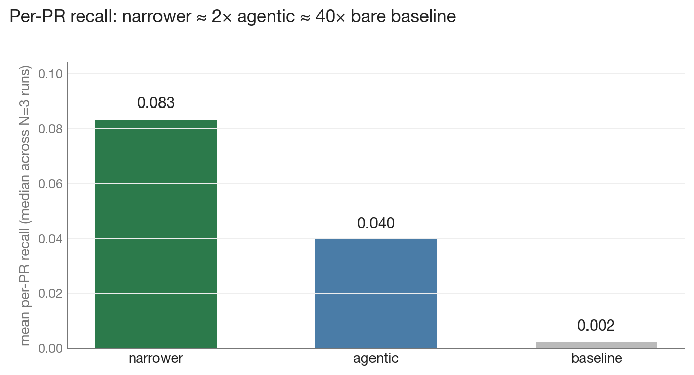
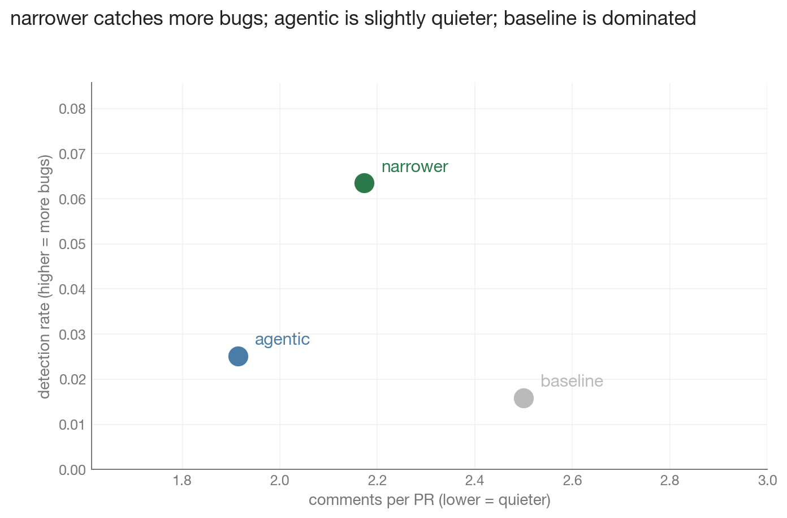
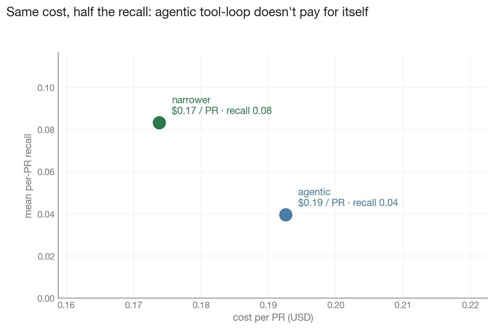

# Under N=3 reruns on 30 PRs, file-system tool access did not lift detection rate above run-to-run variance

**Author:** Nicolás Kriman · **Date:** 2026-05-25 · **Branch:** main · **Framework:** [peer](https://github.com/krilet/peer)

---

## TL;DR

We compared three PR-review setups on the same 30-PR django/pydantic dataset, with N=3 reruns each, scored by a single sonnet judge. By median, a "narrower-context" static recipe edged out an agentic recipe (Read/Grep/Glob, max 15 turns) on bug-catching metrics — but **per-run distributions overlap heavily on every axis**, and one of three agentic runs failed entirely. We cannot conclude that the tool loop is strictly worse for defect detection; only that on this dataset, at this N, with this judge, we observed no improvement from it.

What we *can* say more confidently:

- **The 7-PR result was measurement-bound, not a ceiling.** The same narrower recipe that looked indistinguishable from a 5-line bare baseline at N=5 on 7 PRs showed three above-noise differences at N=3 on 30 PRs. Anyone running LLM PR-review benchmarks on <10 PRs is operating below the noise floor.
- **Two of peer's wins are structural format artifacts, not quality wins.** `severity_calibration` and `suggestion_rate` are zero or negative for the bare baseline because `claude --print <diff>` doesn't emit those fields. Both peer recipes use a structured JSON schema. That's a prompt-engineering win, not a reviewing-skill win.
- **The framework's own multi-objective verdict for all three experiments is `AMBIGUOUS`.** Not "wins," not "dominates." Charts and prose should match.

---

## Experiments

| ID | Recipe | Dataset | N | Framework verdict |
|---|---|---|---|---|
| 1 | `ClaudeCodeCLIReviewer` (narrower context, sonnet) | hard 7-PR | 5 | AMBIGUOUS (1 above_noise, 2 below_noise) |
| 2 | `ClaudeCodeCLIReviewer` (narrower context, sonnet) | v2 30-PR | 3 | AMBIGUOUS (3 above_noise, 1 below_noise) |
| 3 | `AgenticReviewer` (Read/Grep/Glob, max_turns=15) | v2 30-PR | 3 | AMBIGUOUS (2 above_noise, 1 below_noise) |

All AMBIGUOUS because both peer recipes post fewer comments than baseline on `comments_per_pr` — the vector verdict treats that as a strict regression (lower can be either better or worse depending on user preference).

---

## Detection rates sit within run-to-run variance

- `narrower-30`'s detection-rate median is 0.063, our self-defined noise floor is 0.06. The chart shows the per-run values: **2 of 3 runs at 0.063, 1 at 0.167**. The median sits at the *lower bound* of the distribution. Calling this "above noise" is a 3-parts-in-1000 claim.
- `agentic-30` lost 1 of 3 runs to a judge failure. The median is computed from 2 valid runs (0.016 and 0.034). Median-of-2 isn't statistics.
- `baseline-30` per-run values were lost to a file-collision bug in the multirun module (see methodological lessons); only the comparison-report median is preserved.
- On `detection_rate` and `mean_per_pr_recall`, all three whiskers overlap.

---

## Per-metric breakdown

| metric | narrower | agentic | baseline | note |
|---|---:|---:|---:|---|
| `detection_rate` | 0.063 | 0.025 | 0.016 | narrower's per-run values: 0.063, 0.063, 0.167 |
| `mean_per_pr_recall` | 0.083 | 0.040 | 0.002 | narrower's per-run range 0.013 → 0.111 |
| `severity_calibration` | 0.75 | 1.00 | −1.00 | baseline = format artifact (no severity field) |
| `suggestion_rate` | 0.40 | 0.37 | 0.00 | baseline = format artifact (no suggestion field) |
| `comments_per_pr` | 2.17 | 1.91 | 2.50 | agentic is quietest |
| `novelty_rate` | 0.97 | 1.00 | 0.99 | all within 0.03 — no signal |

Two of peer's "wins" over baseline (`severity_calibration`, `suggestion_rate`) are about output format, not reviewing quality. Bare `claude --print <diff>` doesn't emit those fields — the metric scores it the same as a reviewer that emits them but is bad at it.

---

## 2D Pareto: neither recipe dominates

Both `agentic-30` and `narrower-30` are on the Pareto front for (detection_rate, comments_per_pr). Neither dominates the other:

- **narrower has higher detection_rate** (0.063 vs 0.025 by median).
- **agentic has lower comments_per_pr** (1.91 vs 2.17 — i.e., agentic is quieter).

The dashed line connects the two non-dominated points; it's a *front*, not a trade-off curve. The baseline `×` is dominated by both recipes (more comments, fewer bugs caught).

A separate, more confident finding: **narrower-30 dominates narrower-7** on every measured axis. Same recipe, same code, just 4× the dataset. This is the strongest evidence in this report that the 7-PR comparisons were measurement-bound, not real ceilings.

---

## Cost: by median, narrower is cheaper — but distributions overlap

Real per-PR cost from `usage.total_cost_usd` summed across each run and divided by 30 PRs:

- narrower-30 median: **$0.174 per PR**, narrower per-run range $0.145–$0.182
- agentic-30 median: **$0.193 per PR**, agentic per-run range $0.155–$0.193

The two ranges **overlap** in [$0.155, $0.182]. The ~10% median gap is consistent with the per-recipe variance, not larger than it. Same story for per-PR p50 latency: 127s narrower vs 133s agentic (~4% gap, within network jitter).

The honest cost claim is *"by median, narrower is cheaper, but per-run distributions overlap on cost — we can't confidently say the median gap reflects a true cost difference at N=3."*

---

## What this is *not*

1. **Not a generalisation beyond this corpus.** 30 PRs from django + pydantic, gold-defect style bugs. Different domains (security review, perf regressions, refactor detection) could yield different results.
2. **Not a verdict on tool-loops in general.** We tested one configuration: Read/Grep/Glob, max_turns=15, sonnet, T=0. Different tools, larger turn budgets, different models, or different system prompts could change the picture entirely.
3. **Not statistically tight.** N=3 reruns is the floor for "having a median," not a confidence interval. Whiskers (min/max) are wide on every metric. A defensible "X beats Y" claim needs N ≥ 10 and ideally a paired-bootstrap CI.
4. **Not free of judge bias.** All three recipes were scored by the same sonnet model. If sonnet has any preference for peer's structured JSON output (plausible), peer wins by construction on metrics that depend on format.
5. **Not free of prompt confound.** Peer's prompt is substantially longer than baseline's. Longer-context effects on reviewer behaviour are not isolated.

---

## Methodological lessons

Two failure modes hit during this session — flagging both as cautionary patterns for anyone running similar comparisons:

1. **Noise floor at small N.** Experiment 1 (hard 7-PR, N=5) produced "peer ≈ baseline" on every metric. Experiment 2 (same recipe, v2 30-PR, N=3) revealed three above-noise differences. Conclusions drawn from <10 PRs at single-digit N are probably measurement variance, not signal. Compute the reviewer-side run-to-run band on your own corpus *before* claiming any A-vs-B comparison.

2. **Baseline-file collision.** Peer's multirun module wrote `multirun_baseline_<commit_sha>.json` keyed on commit only. Running two different recipes (narrower then agentic) at the same commit caused the second baseline to overwrite the first. When the second baseline run hit a TLS storm and got mostly empty data, the agentic comparison produced a fake "KEEP" verdict. We reconstructed the honest comparison from the preserved narrower-comparison JSON, which contained the good baseline medians. **TODO:** key baseline output on `recipe_hash` as well as commit_sha so reviewers can't clobber each other's baselines.

3. **Same-judge bias is a real risk.** Every comparison in this report used sonnet as judge. We previously measured ~0 cross-judge variance (sonnet/haiku/opus all agreed at N=5 on the same cached reviews), so this is less worrying for the bug-catching metrics, but for format-dependent metrics (`severity_calibration`, `suggestion_rate`) the judge's structural expectations are still the main moving variable.

---

## What we'd want to do next (for a publishable claim)

- **N=10 on the v2-30 set.** Wide enough to put a real CI on the detection_rate gap.
- **Re-score the cached reviews with opus.** Cross-judge sanity on the format-dependent metrics.
- **An expanded dataset** beyond django + pydantic (one larger non-Python repo to break the "static-analysis-style bugs" monoculture).
- **A baseline whose output format matches peer's.** A "structured bare baseline" (claude --print + JSON schema) would isolate format-artifact wins from real ones.
- **Sweep `max_turns` on the agentic reviewer.** The current 15-turn budget may be saturating early or not engaging enough — single-config tests can't tell.

---

## Artifacts

- Multi-run reports: `data/eval_runs/multirun_{d269ac1d,f7caeb70}_*.json`
- Comparison reports: `data/eval_runs/comparison_{d269ac1d,f7caeb70}_*.json`
- Quarantined broken comparison: `data/eval_runs/comparison_d269ac1d_1199de6.broken`
- Chart-generation script: [`make_report_charts.py`](./make_report_charts.py)
- Synthesis notes: [`narrower_v2_30pr.md`](./narrower_v2_30pr.md), [`../may24/agentic_vs_baseline.md`](../may24/agentic_vs_baseline.md), [`../may24/noise_floor_finding.md`](../may24/noise_floor_finding.md)

---

## What to publish

The headline that survives the data:

> **"I gave a code-review LLM file-system tools (Read/Grep/Glob, 15 turns). On 30 PRs with N=3 reruns, defect detection didn't budge above the run-to-run noise band."**

The unintuitive direction (more capability did not yield more detection) is the interesting part. But the supporting language has to be honest about *why* we can't say it more strongly: small N, single dataset, single judge, format-artifact confounds. A consulting-blog audience will accept "we don't yet know" framed alongside "here's exactly how much more we'd need to measure to know" — they won't accept "tool loops are bad" claimed off three reruns of one experiment.
