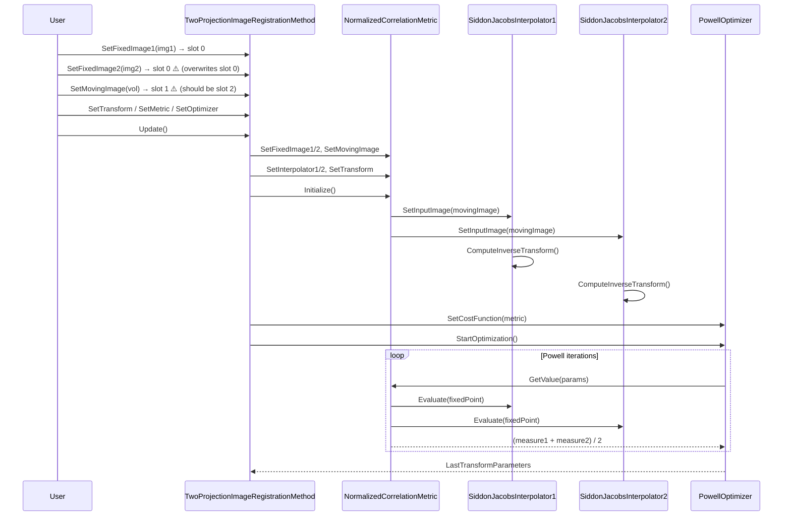

<h3>Greptile Summary</h3>

This PR ingests the `ITKTwoProjectionRegistration` remote module into `Modules/Registration/TwoProjectionRegistration/` using the v4 Mode-A topology-preserving merge pipeline, covering the full set of headers, tests, Python wrapping, and CI configuration.

- **Pipeline input slot collision**: `SetFixedImage2` incorrectly calls `SetNthInput(0, ...)`, the same slot used by `SetFixedImage1`; `SetMovingImage` should also shift to slot 2. Both need fixing to restore correct ITK pipeline dependency tracking.
- **Silent derivative stubs**: `GetDerivative` and `GetValueAndDerivative` in `NormalizedCorrelationTwoImageToOneImageMetric` are marked "under construction" and silently return, producing no error if a gradient-based optimizer is inadvertently used.
- **Baselines not wired to tests**: Five `.cid` baseline files in `test/Baseline/` are present but no active test compares against them, leaving registration output regressions invisible to CI.

<h3>Confidence Score: 3/5</h3>

Hold for fix: SetFixedImage2 and SetMovingImage register at the wrong pipeline input slots, which corrupts ITK's upstream-dependency graph for the registration method.

The registration method's ProcessObject inputs are wired incorrectly — both fixed images land at slot 0, so FixedImage1 is evicted from pipeline tracking the moment FixedImage2 is set. The immediate registration run may still appear correct (the images are also held by direct smart-pointer members), but any pipeline re-execution triggered by an upstream source change will not respect FixedImage1 as a dependency.

itkTwoProjectionImageRegistrationMethod.hxx — both SetFixedImage2 and SetMovingImage use wrong SetNthInput indices.

<h3>Important Files Changed</h3>

| Filename | Overview |
|----------|----------|
| Modules/Registration/TwoProjectionRegistration/include/itkTwoProjectionImageRegistrationMethod.hxx | SetFixedImage2 registers at pipeline input slot 0 (same as SetFixedImage1) instead of slot 1; SetMovingImage should then use slot 2 — both break ITK pipeline dependency tracking. |
| Modules/Registration/TwoProjectionRegistration/include/itkNormalizedCorrelationTwoImageToOneImageMetric.hxx | GetDerivative and GetValueAndDerivative are silent no-ops ('under construction'); will silently produce wrong results if a gradient-based optimizer is ever used. |
| Modules/Registration/TwoProjectionRegistration/test/CMakeLists.txt | Active tests produce output images but never compare against the 5 existing baseline .cid files; registration regressions will not be caught by CI. |
| Modules/Registration/TwoProjectionRegistration/include/itkSiddonJacobsRayCastInterpolateImageFunction.hxx | Core ray-casting DRR interpolator; m_Threshold initialized twice in the constructor (redundant); logic otherwise consistent with Siddon-Jacobs algorithm. |
| Modules/Registration/TwoProjectionRegistration/itk-module.cmake | Module declared correctly; EXCLUDE_FROM_DEFAULT set; TEST_DEPENDS repeats all DEPENDS entries (redundant but harmless). |
| pyproject.toml | Module_TwoProjectionRegistration:BOOL=ON added to the CI configure command; correctly placed in alphabetical order. |
| Modules/Remote/TwoProjectionRegistration.remote.cmake | Remote module stub correctly deleted as part of the ingest; no outstanding references remain. |

<h3>Sequence Diagram</h3>

<!-- greptile_other_comments_section -->

Reviews (1): Last reviewed commit: ["COMP: Drop standalone-build guard from T..."](https://github.com/insightsoftwareconsortium/itk/commit/7dd6f2e1b5dd96f502e54aea740d446ca4daad51) | [Re-trigger Greptile](https://app.greptile.com/api/retrigger?id=34557091)
